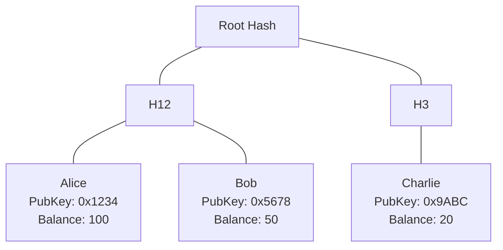
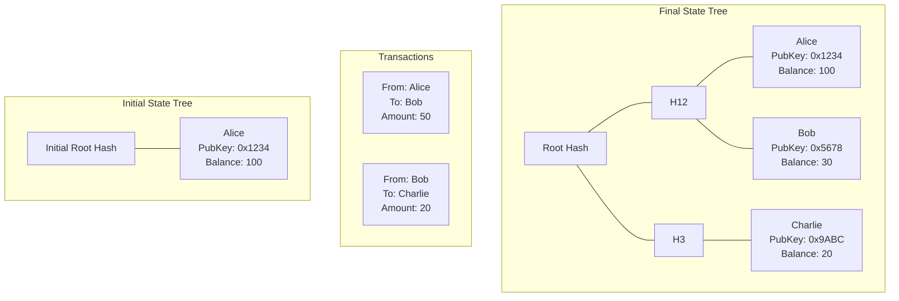

# Proving a state transition (between Ethereum-like state trees)

Say we have a layer-2 blockchain that stores its state (user balances) as a hash tree:

Then we have a state transition function: 
- we apply transactions
- we get a different output tree (of balances)

## What are we proving ?

We want to generate a proof that the state transition function was applied correctly:
- For each transaction
    - Sender had enough balance to send
    - Sender's signature is valid
- When updating balances with the input transactions, I get the expected new state root hash

## What are the inputs to the proof ?

Public inputs:
- initial tree
- transactions applied to it
- expected output root hash

Private inputs: None (yet, see section [To improve](#to-improve))

## Packages
- `mk_static_inputs`: Rust code to generate data that can't be computed in Noir
    (for instance, transaction signatures)
- `state_transition`: Noir code that proves the state transition

## Developer quickstart

Setup using `nix develop` (needs Nix) or `direnv allow` (needs Nix and nix-direnv), then:
- Run Rust tests (generates and prints signature bytes): `utest`
- Run Noir tests (proves state transition): `nr`

## To improve

- pass init_state_tree as private input, pass only init_state_root as public input
- organize transactions as tree, pass root as public input, pass transactions as private input